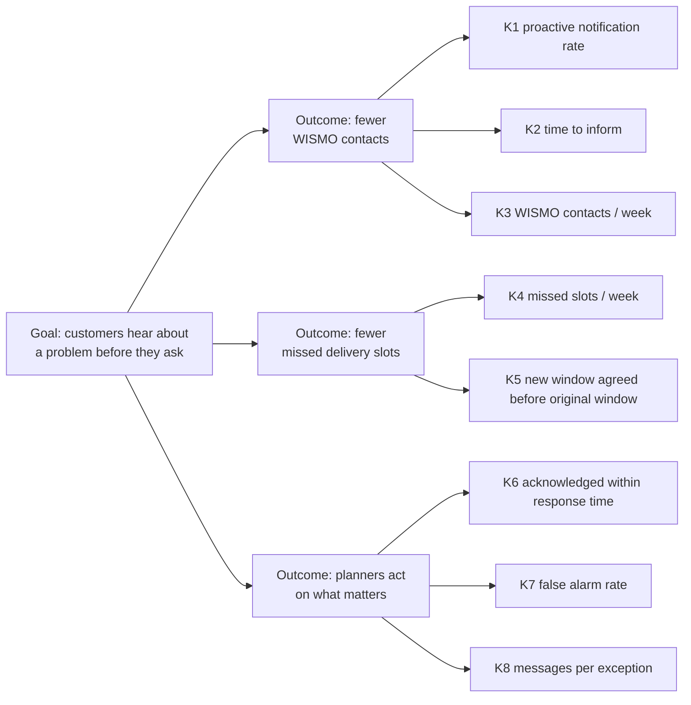

# KPI tree

> **What this is:** how the goal breaks down into measurable indicators, with baseline, target, owner and how each one is measured. **For:** PO, sponsor, team (so that "done" includes "measurable"). **Previous:** [options and business case](options-and-business-case.md) · **Next:** [context](../02-discovery/context.md).

*Baselines and targets are illustrative assumptions — not real company data.*

| ID | KPI | Definition | Baseline | Target (pilot, week 6) | Owner | Frequency |
|---|---|---|---:|---:|---|---|
| K1 | Proactive notification rate | Major/critical exceptions where the customer was told before the window started ÷ all major/critical exceptions | 22% | ≥ 90% | Head of Customer Service | weekly |
| K2 | Time to inform (median) | Exception opened → customer message sent | 3 h 10 min | ≤ 30 min | Head of Customer Service | weekly |
| K3 | WISMO contacts (pilot customers) | Contacts tagged "where is my load" for pilot customers vs. control group | index 100 | ≤ 65 | Head of Customer Service | weekly |
| K4 | Missed delivery slots (pilot customers) | Deliveries outside the window without a new agreed window | index 100 | ≤ 70 | Road planning lead | weekly |
| K5 | Window re-agreed in time | Exceptions where a new window was agreed before the original one started | not measured | ≥ 60% | Road planning lead | weekly |
| K6 | Acknowledged within response time | Exceptions acknowledged within 30 min (critical) / 2 h (major) | not measured | ≥ 95% | Road planning lead | daily in hypercare, then weekly |
| K7 | False alarm rate | Customers notified for an order that was in the end delivered inside the original window | not measured | < 5% | Product Owner | weekly |
| K8 | Messages per exception | Customer messages ÷ exceptions notified | not measured | ≤ 2.0 | Product Owner | weekly |

**Guardrail KPIs** (must not get worse): planner workload (exceptions per planner per shift — target: no more than today's manual checks), unsubscribes from notifications (< 2% of pilot contacts).

## How each baseline is measured

| KPI | Data source today | Gap | How the release closes it |
|---|---|---|---|
| K1, K2 | sample of 60 orders: TMS status history + e-mail and call logs | manual, slow | exception and message timestamps logged by the component ([FR-12](../05-requirements/requirements.md)) |
| K3 | contact-reason tagging in the CS tool (2-week exercise) | tagging is not standard | tag "WISMO" made mandatory for the pilot period (agreed with the Head of CS) |
| K4 | planner log + credit notes | reason often missing | resolution reason code mandatory on close ([US-04](../06-backlog/user-stories.md)) |
| K6–K8 | — | do not exist | pilot measurement export ([US-13](../06-backlog/user-stories.md)) |

Control group: five customers on the same route cluster with comparable volume and mix, not in the pilot. Without it, a quiet week at sea would look like success.

---

[Documentation map](../00-documentation-map.md) · Next: [Context →](../02-discovery/context.md)
