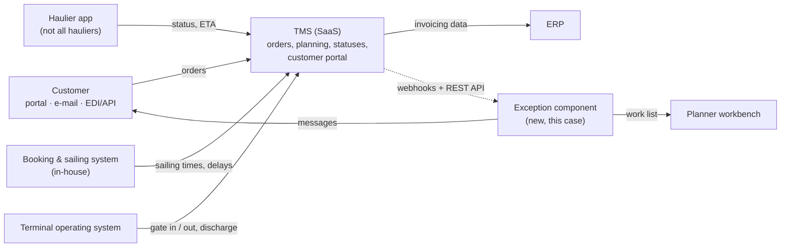

# Context — Tidewell Logistics after the TMS go-live

> **What this is:** the fictional organisation, its systems and the scope of this case. **For:** anyone opening the case for the first time. **Previous:** [KPI tree](../01-opportunity/kpi-tree.md) · **Next:** [stakeholders](stakeholders.md).

*Independent portfolio case study based on a fictional organisation. It contains no confidential information from any real employer or the hiring company. All figures are illustrative assumptions — not real company data.*

## The organisation

**Tidewell Shortsea Lines** is a fictional RoRo short-sea operator between a Belgian continental terminal, two UK terminals and one Irish terminal. Its booking and amendment process is the subject of a companion case ([late booking amendments](https://github.com/phlppgdfry/shortsea-booking-functional-analysis)). This case is set in its **door-to-door division, Tidewell Logistics**.

| | |
|---|---|
| Business | Door-to-door transport of trailers and containers between the Continent and the UK/Ireland: collection at the shipper, pre-carriage by road (subcontracted hauliers) or rail, terminal, sea crossing, on-carriage, delivery in an **agreed delivery window** at the consignee |
| Volume | ±1,600 door-to-door orders a week |
| Customers | ±250 shippers and forwarders. 15 large customers exchange orders and statuses by EDI or API; the rest use the customer portal, e-mail and phone |
| Hauliers | ±60 subcontracted haulage companies. About half send statuses through the haulier app; the rest call or e-mail the planner |
| People | Customer service (±22 FTE), road planning (±18 planners in shifts), customs desk, account managers, terminal operations |

## Systems

| System | Owner | Relevant for this case |
|---|---|---|
| **TMS (SaaS)**, live for ±6 months | Product Owner TMS + supplier | Holds orders, delivery windows, statuses and ETAs. Publishes webhooks for status and ETA changes; REST API to read orders. Has standard e-mail notifications per status. **No exception object, no severity, no owner.** |
| Booking & sailing system (in-house) | IT Development | Source of sailing times and delays (see the companion case) |
| Terminal operating system | Terminal IT | Gate-in, discharge, yard events |
| Haulier app | TMS supplier | Statuses from hauliers that use it |
| Customer service tool | Customer service | Contact logging and reason tags |
| "Disruption sheet" (Excel) | Road planning | Today's workaround: affected orders per delay, copied by hand |

## Organisation around the backlog

| Role | In this case |
|---|---|
| Product Owner *Customer Visibility* | Owns the backlog, decides priority and scope |
| Scrum Master | Runs the ceremonies, protects the sprint |
| Development team | 4 developers, 1 tester |
| **Business analyst (my role in this case)** | Frames the problem, runs discovery and workshops, prepares the backlog with the PO, writes stories and acceptance criteria, designs the screens, organises BAT and release readiness |
| Application support | First and second line; owns end-user documentation after the release |
| Sponsor | COO |

## Why now

- The TMS go-live fixed order intake but made the gap visible: customers now see **statuses** in the portal, but not whether their **delivery window** is at risk.
- WISMO contacts did not go down after the go-live (±38% of all contacts).
- The management team made "predictability for customers" a priority for the next half-year.

## Scope

**Release 1 (pilot):** detect exceptions on door-to-door orders (sailing delay or cancellation, road delay, terminal delay, missing status), decide severity, owner and response time, one work list for planners, proactive customer message through portal and e-mail, recovery message, key-account call task, pilot measurement. One route cluster (BE-UK East and BE-UK South), five pilot customers, behind a feature toggle.

**Release 2:** status messages for EDI/API customers, customs holds (customs desk), notification preferences in the portal, all customers.

**Release 3 / later:** consignee notifications (GDPR and contract questions), ETA prediction, automatic re-planning.

**Out of scope:** quay-to-quay customers (they have their own sailing notifications), changes to the TMS itself beyond configuration.

## Assumptions

| ID | Assumption | Why it matters | Check with | Status |
|---|---|---|---|---|
| A-01 | The TMS webhook fires within 2 minutes of a status or ETA change | Time to inform (K2) depends on it | TMS supplier | confirmed in sprint 1 spike |
| A-02 | The agreed delivery window is filled in for ≥95% of door-to-door orders | Rules ER-01/ER-02 need the window | TMS data, 8 weeks | **72% only** → data-quality story and default rule ([D-06](../03-workshops/decision-log.md)) |
| A-03 | Pilot customers accept e-mail + portal messages; no SMS needed | Notification channel | 5 pilot customers | confirmed |
| A-04 | Planners can absorb the work list without extra staff | Guardrail KPI | Road planning lead | to be measured in the pilot |

---

[Documentation map](../00-documentation-map.md) · Next: [Stakeholders →](stakeholders.md)
