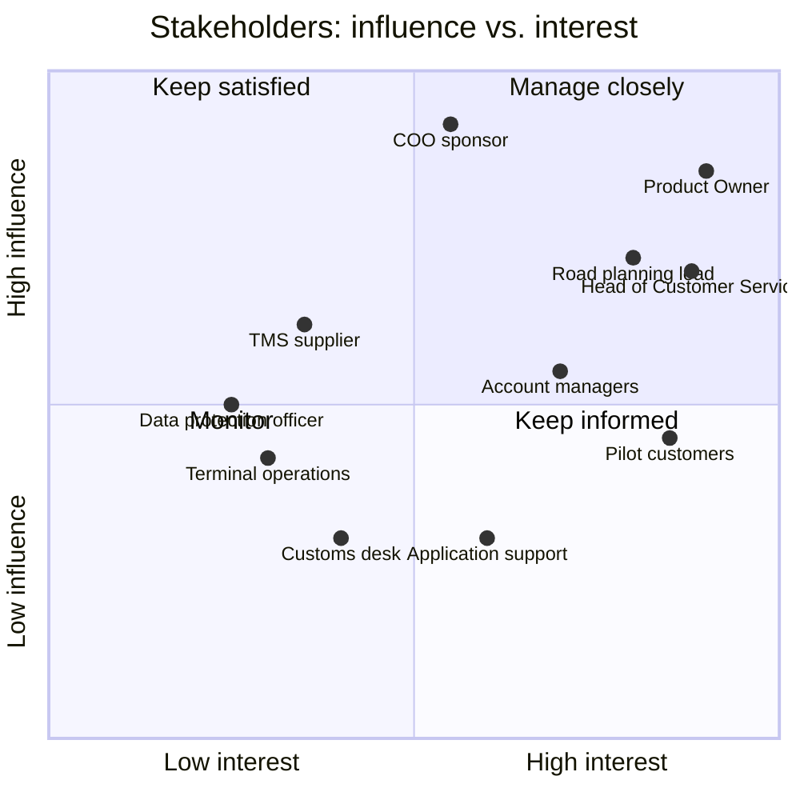

# Stakeholders

> **What this is:** who is affected, what each group wants, where they disagree and how I involved them. **For:** PO and team, to know whom to ask and whom to convince. **Previous:** [context](context.md) · **Next:** [interview notes](interview-notes.md).

## Influence and interest

## Stakeholder matrix

| Stakeholder | Interest | Pain today | Wants | Possible resistance | How I involved them |
|---|---|---|---|---|---|
| **Product Owner** Customer Visibility | Value per sprint | Three conflicting requests, one team | A small first release that proves value | — | Weekly backlog session; options and business case prepared for her decisions |
| **COO** (sponsor) | Predictability, cost | Complaints reach the board | A number that moves | Impatience with pilots | Business case with a stage gate; 1-page update after each sprint review |
| **Head of Customer Service** | Fewer WISMO calls | ±125 h/week on one question | "A tracking page" | Expects a quick fix | Interview; call-reason tagging; key user in BAT |
| **Road planning lead** + planners | Re-planning without interruptions | Calls while re-planning; Excel sheet | No extra work, no false alarms | **High**: "I already call the important customers myself" | Shadowed a morning shift; senior planner as key user; workbench designed with them |
| **Account managers** | Key-account relationship | Hear problems from customers | "Tell key accounts everything" | Conflict with planners on volume | Event storming; decision D-02 explained in their team meeting |
| **Pilot customers** (5) | Plan their docks and staff | Hear late, at the gate | One clear message with a new ETA | Message fatigue | 2 customer interviews; message templates tested with them |
| **Application support** | Supportable releases | New releases arrive without explanation | Documentation before go-live, not after | — | In refinement from sprint 1; KB article reviewed by them |
| **TMS supplier** | Contract scope | — | Clear API usage | Dependency on their roadmap | Spike on webhooks; decision D-03 |
| **Customs desk** | Releases on time | Customers react slowly to holds | Customer asked to act, with what is missing | Not in the R1 pilot | Interview; scope R2 |
| **Data protection officer** | GDPR | — | No driver location to customers; purpose of contact data clear | Blocks consignee messages | Review of message content and data; decision D-05 |
| **Terminal operations** | Discharge and yard flow | — | Terminal delays owned by the terminal | — | Owner of the TERMINAL_DELAY type (ER-08) |

## RACI for the release

| Activity | PO | BA | Dev team | Tester | Road planning lead | Head of CS | App support | Sponsor |
|---|---|---|---|---|---|---|---|---|
| Problem and business case | A | R | C | — | C | C | — | I (approves funding) |
| Exception rules (thresholds) | A | R | C | C | C | C | I | — |
| Backlog order | A/R | C | C | C | I | I | I | I |
| Stories and acceptance criteria | A | R | C | C | C | C | I | — |
| Screen design | A | R | C | C | C | C | I | — |
| Build and system test | I | C | R | R | — | — | I | — |
| Business Acceptance Testing | A | R (organises) | C | C | R (key users) | R (key users) | C | — |
| Go/no-go | A | R (prepares) | C | C | C | C | C | I |
| End-user documentation | I | C | — | — | C | C | A/R | — |

*The BA is responsible for a lot but accountable for little: decisions on scope, priority and go-live stay with the Product Owner.*

---

[Documentation map](../00-documentation-map.md) · Next: [Interview notes →](interview-notes.md)
