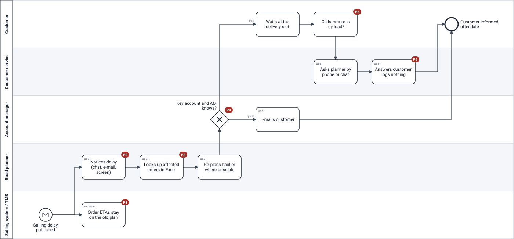

# AS-IS process — a sailing is delayed (today)

> **What this is:** how a delay reaches the customer today, with the pain points numbered. **For:** PO, sponsor and team, as the baseline the TO-BE is measured against. **Previous:** [decision log](../03-workshops/decision-log.md) · **Next:** [TO-BE process](to-be.md).

Modelled in BPMN 2.0 from the shadowing session and the event storming. Source: [`bpmn/as-is.bpmn`](bpmn/as-is.bpmn) (opens in Camunda Modeler or bpmn.io; generated by [`scripts/build_bpmn.py`](../../scripts/build_bpmn.py)).

## Pain points

| # | Where | What goes wrong | Evidence |
|---|---|---|---|
| P1 | TMS | Order ETAs stay on the old plan until a planner updates them; the portal shows "planned" while the sailing is already late | shadowing: 2 of 7 delayed orders still showed the old ETA 1 h later |
| P2 | Road planner | The delay is noticed by chance: chat, e-mail, haulier WhatsApp, the sailing screen | interview #2 |
| P3 | Road planner | Affected orders are looked up by hand and copied into an Excel sheet | shadowing: ±25 min per delayed sailing |
| P4 | Account manager | Only key accounts whose AM happens to know are told; everyone else is not | interview #4; 22% proactive rate |
| P5 | Customer | The customer finds out at the delivery slot and calls | 1,250 WISMO contacts / week |
| P6 | Customer service | The answer is given by phone and not recorded; nobody learns why delays were missed | no reason codes on 60% of credit notes |

## Why model it at all?

Because the AS-IS shows that the problem is **not the TMS**. The information exists (the sailing system knows the delay within minutes). It gets lost between people: nobody owns the step from "delay known" to "customer told". That is why the TO-BE adds **ownership and rules**, not a new tracking screen.

## Modelling choices

- **One scenario (sailing delay), not all causes.** Road delays and missing statuses follow the same path with a different start event. Modelling them separately would repeat the same lanes without new insight.
- **Lanes per role, not per department.** The account manager is a separate lane because the AS-IS depends on whether *this person* knows.
- **Customer as a lane.** Usually a separate pool with message flows; I kept one pool so the diagram fits on a screen and the waiting at the slot is visible next to our own steps.

---

[Documentation map](../00-documentation-map.md) · Next: [TO-BE process →](to-be.md)
