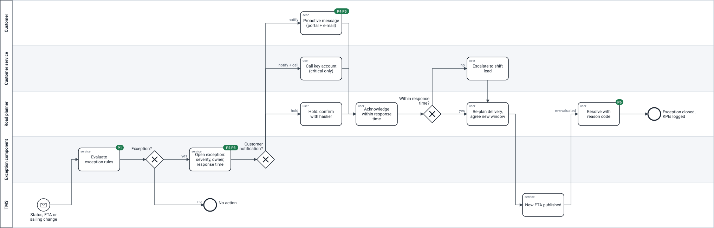

# TO-BE process — exception management (release 1)

> **What this is:** the target process after release 1, and what changes compared to today. **For:** PO, team, key users and application support. **Previous:** [AS-IS](as-is.md) · **Next:** [UML models](uml.md).

Source: [`bpmn/to-be.bpmn`](bpmn/to-be.bpmn) (valid BPMN 2.0 with diagram interchange). Green labels show which AS-IS pain point each step removes.

## What changes

| Step | Today | After release 1 | Fixes |
|---|---|---|---|
| Detect | Planner notices by chance | Every status, ETA or sailing change in the TMS is evaluated by the [exception rules](../05-requirements/exception-rules.md) within 2 minutes | P1 |
| Decide if it matters | Gut feeling, Excel | Severity, owner and response time from the rules; delays inside the window are not exceptions | P2, P3 |
| Tell the customer | Only if the AM knows | Major and critical: proactive message in the portal and by e-mail; key account + critical: also a call task for customer service | P4, P5 |
| Missing status | Either ignored or an alarm | Planner confirms with the haulier first; customer message held until then | — (new) |
| Respond | When the phone rings | Acknowledge within 30 min (critical) or 2 h (major); otherwise escalated to the shift lead | P2 |
| Close | Not recorded | Reason code mandatory; KPIs logged | P6 |

## Exception lifecycle

The exception's own states are in the [state diagram](uml.md#exception-lifecycle-uml-state-diagram). Every ETA change re-evaluates the exception: it can become worse (new message, ER-12 allows it), better, or recover inside the window (recovery message, ER-13).

## Exceptions to the happy path

| Situation | What happens | Rule / requirement |
|---|---|---|
| Sailing updated three times in 10 minutes | One message; later updates within 2 h only if worse | ER-12 · found in BAT ([DEF-04](../09-acceptance/bat-log.md)) |
| ETA comes back inside the window | Exception closes as "recovered"; customer told only if they were told before | ER-13 |
| Order has no delivery window | Window assumed = planned ETA + 2 h, flagged in the workbench | FR-03 · [D-06](../03-workshops/decision-log.md#d-06) |
| Customer contact address bounces | Exception gets a "message failed" flag; CS task to call | FR-09 |
| Webhook not received for 15 min | Application support alert; component re-reads changed orders via the API | NFR-04 |
| Planner does not acknowledge in time | Escalation to the shift lead | ER-09 · FR-07 |

## What is deliberately not in the TO-BE

Automatic re-planning (planners re-plan; the system only tells), consignee messages (D-05), EDI/API status messages and customs holds (release 2).

---

[Documentation map](../00-documentation-map.md) · Next: [UML models →](uml.md)
