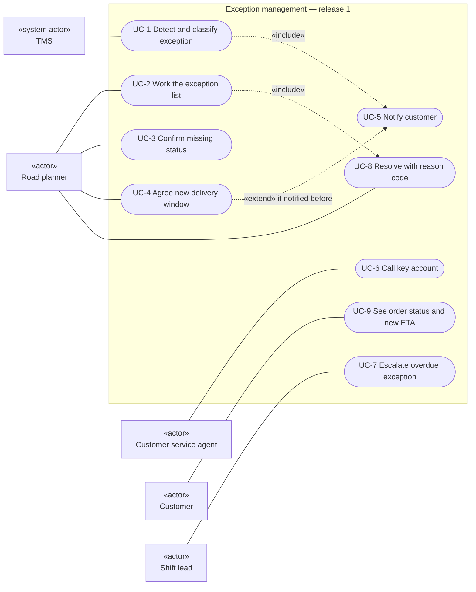
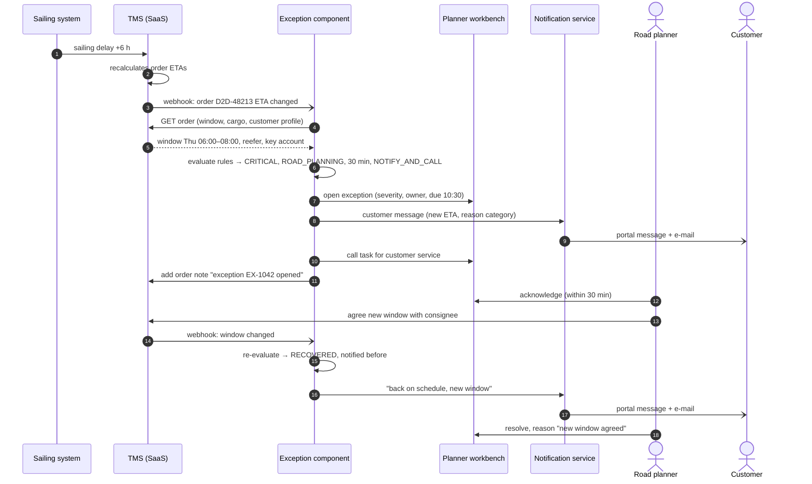
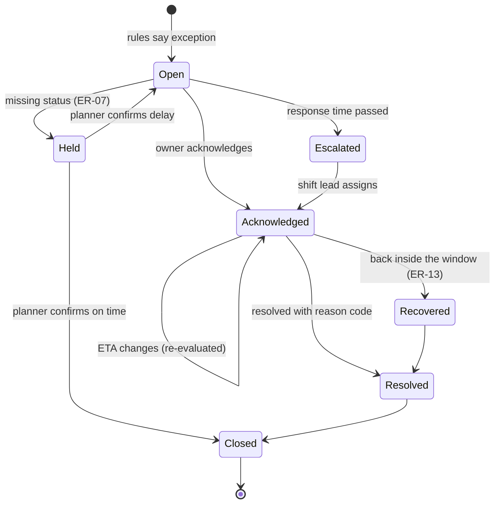

# UML models

> **What this is:** three UML views of the same release — who uses it (use case), how the systems talk (sequence) and how an exception moves through its life (state). **For:** developers, testers and the PO. **Previous:** [TO-BE process](to-be.md) · **Next:** [exception rules](../05-requirements/exception-rules.md).

Diagrams are in Mermaid so they render on GitHub and stay editable in a pull request. Mermaid has no native use-case notation; the first diagram uses the UML conventions (actors outside, use cases as ovals inside the system boundary) with a flowchart.

## Use cases (UML use case diagram)

| Use case | Primary actor | Stories |
|---|---|---|
| UC-1 Detect and classify | TMS (event) | US-01, US-02 |
| UC-2 Work the list | Road planner | US-03 |
| UC-3 Confirm missing status | Road planner | US-08 |
| UC-4 Agree new window | Road planner | US-04, US-10 |
| UC-5 Notify customer | system | US-05, US-07 |
| UC-6 Call key account | CS agent | US-11 |
| UC-7 Escalate | Shift lead | US-03 (AC-03.4) |
| UC-8 Resolve | Road planner | US-04 |
| UC-9 See status and ETA | Customer | US-05 |

## How the systems talk (UML sequence diagram)

Scenario: the sailing of a reefer for a key account is delayed by six hours.

Failure paths agreed in refinement: if step 4 fails, the component retries 3 times with back-off and then raises an application-support alert; the webhook is idempotent on the TMS event ID, so a re-sent event does not open a second exception ([NFR-03](../05-requirements/requirements.md)).

## Exception lifecycle (UML state diagram)

Every arrow is at least one test case; the testers used this diagram to find two transitions the stories did not cover (Held → Closed, Escalated → Acknowledged). Both are now acceptance criteria in [US-08 and US-03](../06-backlog/user-stories.md).

---

[Documentation map](../00-documentation-map.md) · Next: [Exception rules →](../05-requirements/exception-rules.md)
