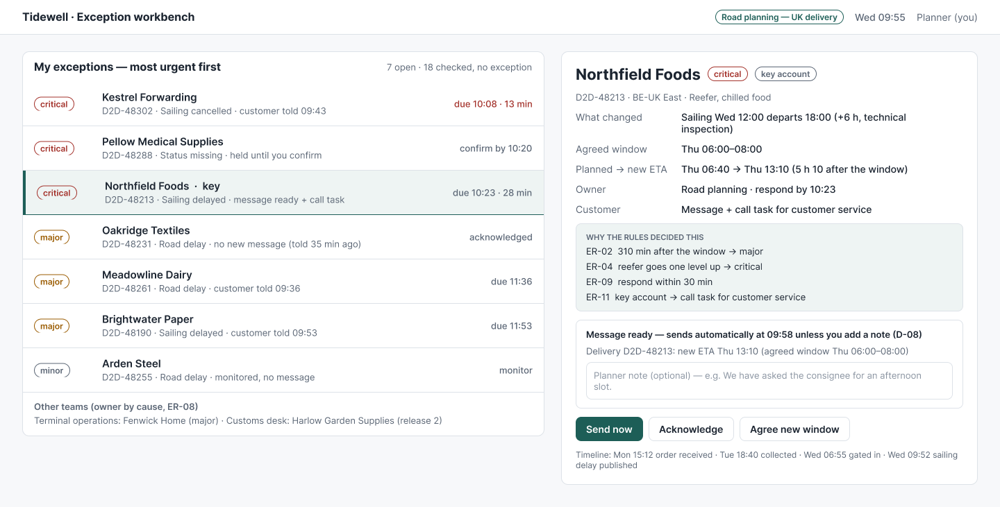
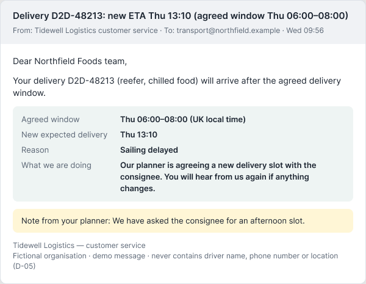
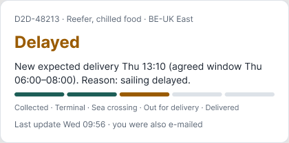
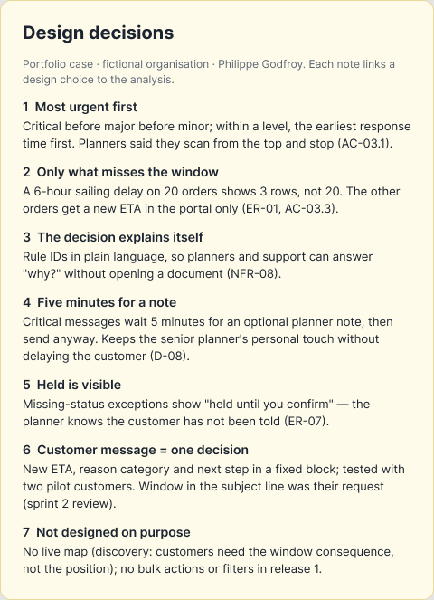

# Design — workbench, customer message, portal

> **What this is:** the screens for release 1, why they look like this, and how they were validated. **For:** PO, developers, key users. **Previous:** [definition of ready and done](../06-backlog/definition-of-ready-done.md) · **Next:** [sprint plan](../08-delivery/sprint-plan.md).

| Artefact | Where |
|---|---|
| Figma screens (planner workbench, customer e-mail, portal status card, design-decision notes, reusable "Exception row" component) | [Figma file](https://www.figma.com/design/W6hussB5UmQf2wwWEkeJnI) · exports below |
| Event storming board in FigJam | [FigJam board](https://www.figma.com/board/xebYRE5Vpm5v2NCc2tuDQe) · [web version](https://phlppgdfry.github.io/shipment-exception-management-business-analysis/event-storming/) |
| Clickable prototype (same rules as the tests) | [prototype on GitHub Pages](https://phlppgdfry.github.io/shipment-exception-management-business-analysis/prototype/) |

## Planner workbench

## Customer message and portal

| E-mail (major / critical) | Portal status card |
|---|---|
|  |  |

## Design decisions

| # | Decision | Traces to |
|---|---|---|
| 1 | Most urgent first: severity, then response time | AC-03.1 |
| 2 | Only orders that miss their window are listed | ER-01, AC-03.3 |
| 3 | The decision explains itself with the rule IDs in plain language | NFR-08 |
| 4 | Critical messages wait 5 minutes for an optional planner note | D-08, AC-05.4 |
| 5 | "Held" is visible, so the planner knows the customer has not been told | ER-07 |
| 6 | The customer message is one fixed block: window, new ETA, reason, next step; window in the subject line | US-05, sprint review feedback |
| 7 | Deliberately not designed: live map, filters, bulk actions | discovery, prioritisation |

## How the design was validated

| When | With whom | Method | What changed |
|---|---|---|---|
| Sprint 0 | senior planner, planning lead | paper sketch of the list next to their Excel sheet | sort order changed from "newest first" to "most urgent first" |
| Sprint 1 | two pilot customers | message template read aloud on a call: "what would you do after reading this?" | reason category added; driver name removed (also D-05) |
| Sprint 1 | DPO | template review | "consignee" wording clarified |
| Sprint 2 review | pilot customer A | live demo | agreed window added to the subject line |
| BAT | key users | real messages in their own inbox | local time instead of UTC (DEF-01) |

## Why a prototype as well as Figma

Figma shows the screens; the [prototype](https://phlppgdfry.github.io/shipment-exception-management-business-analysis/prototype/) shows **behaviour**: what happens when the ETA changes again, when a held exception is confirmed, when nobody acknowledges in time. Those are the moments where analysis errors hide, and they are hard to show with static frames. The prototype runs on the same rule module as the acceptance tests, so it cannot drift from the specification.

*All screens use fictional data. No employer branding is used or imitated.*

---

[Documentation map](../00-documentation-map.md) · Next: [Sprint plan →](../08-delivery/sprint-plan.md)
